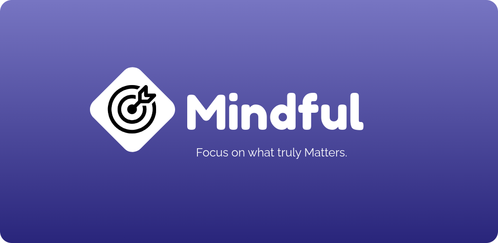

<div align="center">



<h1><b>NLP-Digitox</b></h1>
<p><em>Presence over pixels.</em></p>

<p>
  
  
  
  
  
  <a href="https://github.com/DraculaHub786/NLP-digitox/issues"></a>
  <a href="https://github.com/DraculaHub786/NLP-digitox/stargazers"></a>
</p>

<p>
  <a href="#-features">Features</a> •
  <a href="#-why-nlp-digitox">Why NLP-Digitox</a> •
  <a href="#-screenshots">Screenshots</a> •
  <a href="#-getting-started-for-developers">Get Started</a> •
  <a href="#donate">Donate</a> •
  <a href="#feedback-and-support">Support</a>
</p>

</div>

---

**NLP-Digitox** is a free, open-source digital wellbeing app for Android that helps you take back control of your screen time, sharpen your focus, and build healthier habits — without selling your data or holding your progress hostage behind a subscription. Whether you're battling short-form-video addiction, trying to protect a child's screen time, or just want your evenings back, NLP-Digitox gives you the tools without the catch.

<a id="-why-nlp-digitox"></a>
## ✨ Why NLP-Digitox?

Most screen-time apps make you choose between *actually working* and *respecting your privacy*. NLP-Digitox doesn't ask you to choose.

| | NLP-Digitox | Typical "free" digital-wellbeing apps |
|---|---|---|
| 💸 **Price** | Free, forever | Free tier crippled behind a paywall |
| 📖 **Source** | 100% open source, auditable on GitHub | Closed source — you're trusting a black box |
| 📡 **Core features offline** | Yes — blocking, limits, focus mode, bedtime mode never touch the network | Usually phone-home even for basic limits |
| 🎯 **Ads / trackers** | None. Zero. | Ad-supported "free" tiers are common |
| 🔓 **Tamper resistance** | Invincible Mode + optional biometric lock, built for real accountability (kids, self-discipline) | Often trivially disabled mid-binge |
| 🌍 **Languages** | 28 languages out of the box | Usually English-only or a handful |
| 🧠 **AI, if you want it** | Optional persona-aware chatbot & insights — opt in, or ignore entirely | Rarely offered, or mandatory and data-hungry |

---

## 💪 Features

<table>
<tr>
<td width="50%" valign="top">

### 🎯 Focus Mode
Countdown or stopwatch sessions for Study, Work, or Creative work. Review your session timeline to see what's actually consistent — and what isn't.

### ⏱️ Screen Time Limits
Set daily limits per app, especially for the addictive stuff (Reels, Shorts, TikTok-style feeds). Group similar apps, share limits across a group, and flip on **Invincible Mode** to lock a limit in once it's hit — no last-minute "just five more minutes" loophole.

### 📊 Detailed Usage Insights
Weekly screen time, per-app usage, and data consumption — all laid out so you can actually see the pattern, not just feel guilty about it.

### 🚫 App & Internet Blocking
Block distracting apps outright, or cut their internet access with one tap via a local, on-device VPN — no root required. Filter adult content and build a genuinely focused environment.

</td>
<td width="50%" valign="top">

### 🔔 Notification Management
Batch notifications, schedule delivery windows, or mute noisy apps during focus sessions. Fewer interruptions, more attention.

### 🌙 Bedtime Mode
Apps pause and Do Not Disturb kicks in automatically at bedtime, and everything quietly resumes when your day starts. No manual toggling required.

### 👨‍👩‍👧 Parental Controls
Tamper-proof restrictions, Invincible Mode, and an optional biometric lock so a determined 11-year-old can't just uninstall their way out of a limit.

### 🤖 AI Chatbot & Smart Insights *(optional)*
A persona-aware chatbot and sentiment-aware suggestions, powered by Groq. Fully opt-in — skip it entirely and the rest of the app is unaffected.

</td>
</tr>
</table>

### ☁️ Account, Cloud Backup & Leaderboard *(optional)*
Sign in with Google if you want your persona/onboarding state backed up (so a reinstall doesn't force you through the quiz again), a synced profile picture, and a spot on the leaderboard. Entirely skippable — the app is fully functional without ever creating an account.

### 🔒 Privacy-Conscious & Open Source
No ads, no third-party analytics, no data sold, ever. The features that matter most — focus mode, blocking, screen time limits, bedtime mode — run **entirely on-device** and need no account and no internet connection. The optional account features (cloud backup, leaderboard, AI chatbot) do talk to Firebase and Groq, transparently — see [*Why internet permission?*](#why-internet-permission-in-manifest) below. Every line of code is public; audit it yourself.

### 🌍 28 Languages, Out of the Box
`en` `es` `fr` `de` `it` `pt` `ru` `ja` `ko` `zh` `ar` `he` `hi`-adjacent locale coverage and 15+ more — this isn't an English-only project bolted on for one region.

---

## 🖼️ Screenshots

|  |  |  |  |
| ---------------------------------------------------- | ---------------------------------------------------- | ---------------------------------------------------- | ---------------------------------------------------- |
|  |  |  |  |

---

## 🚀 Getting Started (for developers)

```bash
git clone https://github.com/DraculaHub786/NLP-digitox.git
cd NLP-digitox
flutter pub get
flutter build apk --release --dart-define-from-file=.env #(production build)
flutter run / flutter build apk --debug #(Development debug)
Flutter run #(Test on device)
```

Requires **Android 8.0 (API 26)** or higher on the target device. iOS isn't currently supported (this app relies on Android-only APIs — usage stats, accessibility service, and a local VPN — for its core blocking features).

### 🔑 API Key & Cloud Setup (optional, only for AI/cloud features)

The app runs and builds fine with zero configuration — you only need this if you want the AI chatbot or profile picture upload working locally. NLP-Digitox uses **two separate mechanisms**, depending on the service:

**1. Groq / Gemini** (AI chatbot, sentiment analysis) — compiled in as Dart constants, not read from `.env`:
```bash
cp lib/config/api_keys_template.dart lib/config/api_keys.dart
```
Then open `lib/config/api_keys.dart` and paste in your keys — a free Groq key from [console.groq.com/keys](https://console.groq.com/keys), and optionally a Gemini key from [aistudio.google.com/apikey](https://aistudio.google.com/apikey). The file is gitignored; your keys never get committed. Run normally with `flutter run` — no extra flags. Without a key, the chatbot just shows "not configured" and everything else works as usual.

**2. Cloudinary** (profile picture uploads) — injected at build time via `--dart-define-from-file`:
```bash
cp .env.example .env
# fill in CLOUDINARY_CLOUD_NAME, CLOUDINARY_UPLOAD_PRESET, etc.
flutter run --dart-define-from-file=.env
```
VS Code users: `.vscode/launch.json` already passes this flag — just hit Run/Debug. `.env` is gitignored. Without it, profile picture upload fails silently but sign-in and everything else still works.

---

> [!IMPORTANT]
> ## Why _internet_ permission in manifest?
>
> The `INTERNET` permission covers a few distinct, all-opt-in things:
> - **Local VPN** — Android requires network permission to create and protect a Local VPN tunnel, which is how NLP-Digitox blocks internet access for selected apps. Needs no account and no external connection.
> - **Firebase Auth & Firestore** — only contacted if you choose to sign in, to back up your onboarding/persona state and power the leaderboard.
> - **Groq API** — only contacted if you use the AI chatbot / sentiment features.
> - **Cloudinary** — only contacted if you upload a profile picture.
>
> None of the above is required to use the core app. Focus mode, blocking, screen-time limits, and bedtime mode work fully offline with no account, ever. You can verify exactly what's being sent by checking the app's network usage in your device settings.

---

## 🗺️ Roadmap

- [ ] iOS support (blocked on Android-only APIs used for blocking — exploring alternatives)
- [ ] More granular per-app schedule rules
- [ ] Expanded AI-driven weekly insights

Have an idea? [Open an issue](https://github.com/DraculaHub786/NLP-digitox/issues/new) — this is a community-shaped roadmap.

---

## Donate

NLP-Digitox is free, ad-free, and built and maintained in spare time. If it's helped you put your phone down a little more, consider supporting development:

<p>
  <a href="https://buymeacoffee.com/afjalansari29162"></a>
  &nbsp;&nbsp;&nbsp;
  
</p>

☕ **[Buy Me a Coffee](https://buymeacoffee.com/afjalansari29162)** · 🇮🇳 UPI QR above for India-based supporters

Donations are entirely optional and never gate any feature — this will always be a free, full-featured app.

---

## Feedback and Support

Your feedback is invaluable to us! If you have suggestions, encounter issues, or simply want to share your thoughts, please reach out:

* **[GitHub Issues](https://github.com/DraculaHub786/NLP-digitox/issues/new)** - Report bugs or suggest features
* **[Email Support](mailto:afjalansari29162@gmail.com)** - Contact developer directly
* **[Telegram](https://t.me/mdDracula)** - Chat directly with the developer
* **[Instagram](https://www.instagram.com/_afjal___ansari_?igsh=ZGlkZDU4eHF6NGM4)** - Follow for updates
* **[LinkedIn](https://www.linkedin.com/in/afjal-ansari-999067299)** - Connect professionally

<div align="center">
<sub>Built with Flutter, out of frustration with apps that make privacy a premium feature. If NLP-Digitox helped you, a ⭐ on this repo goes a long way.</sub>
</div>