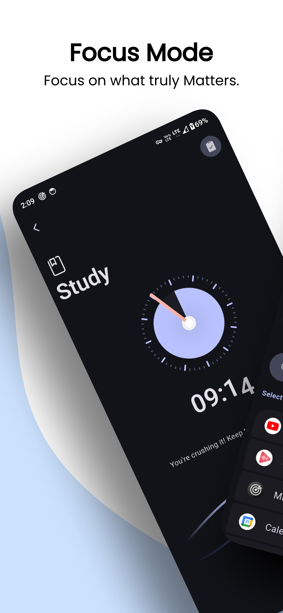
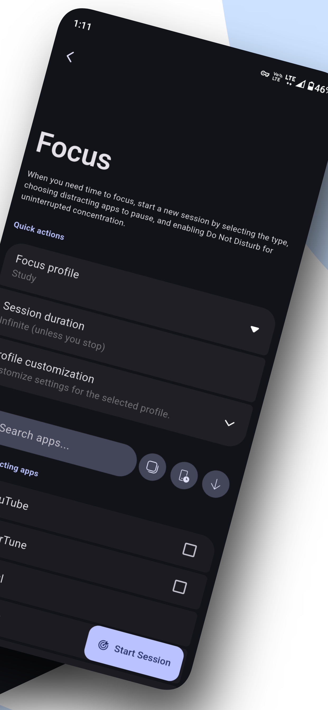
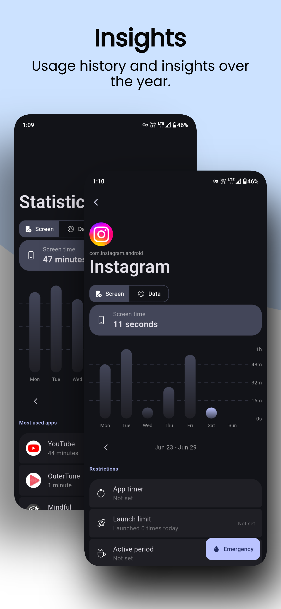
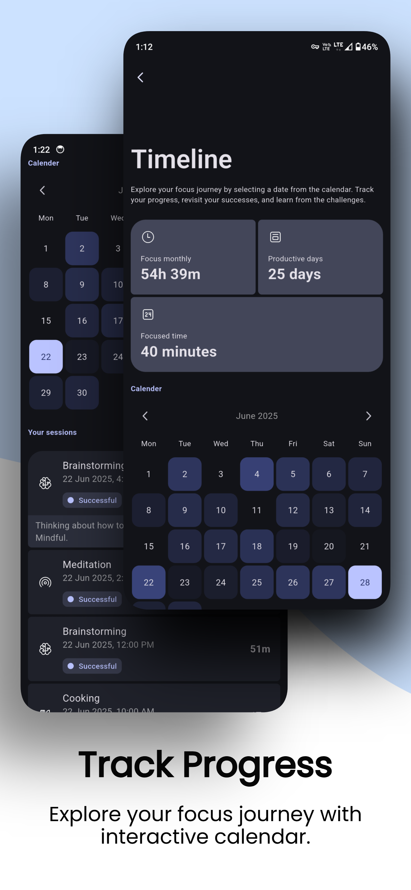
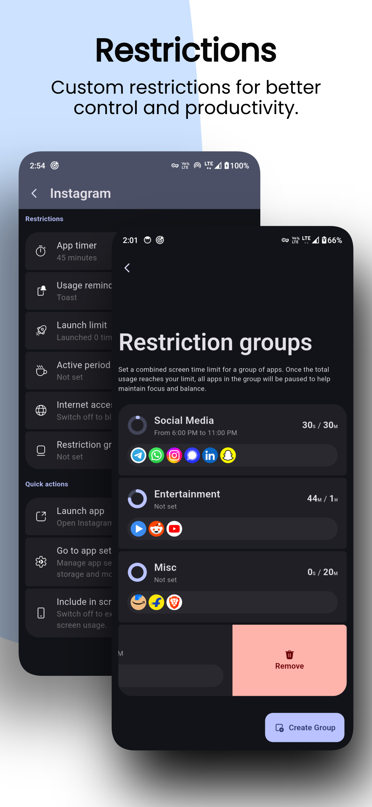
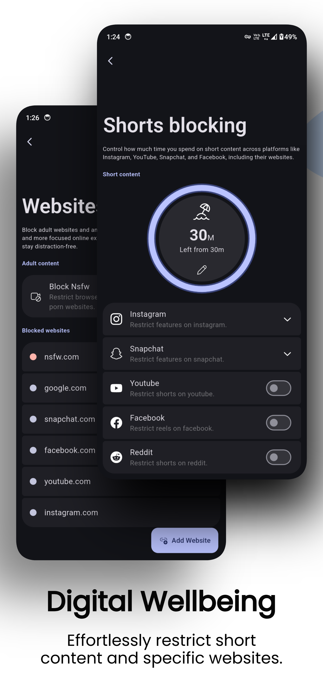
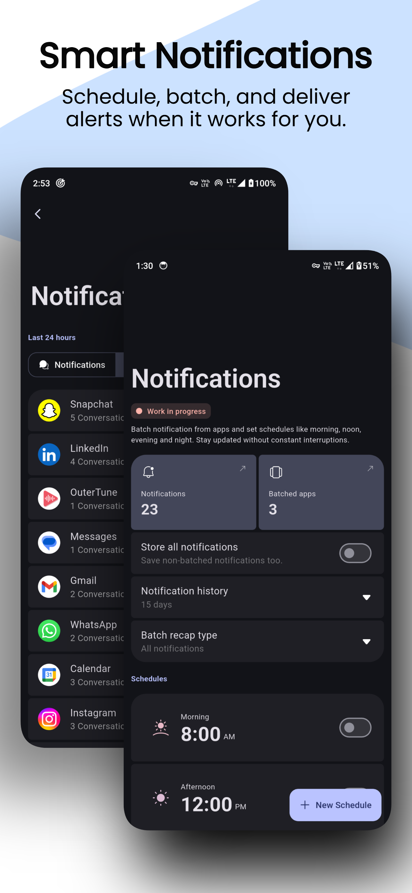
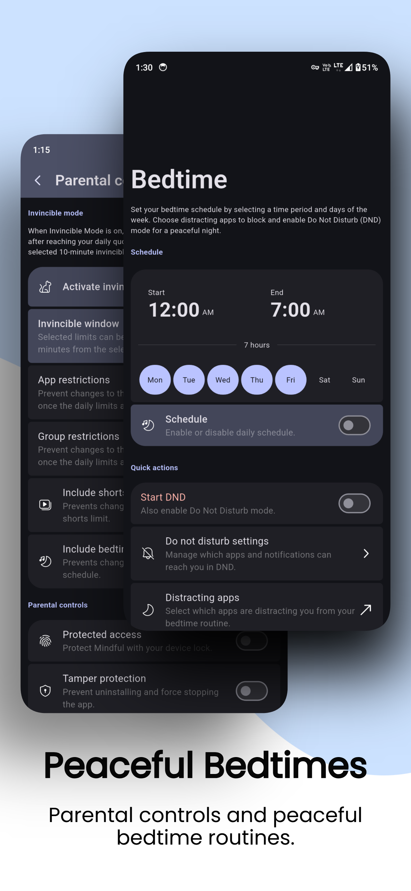

    <h1> <b>NLP-Digitox</b></h1>
    
<em>Presence over pixels</em>

**NLP-Digitox** is a free and open-source app designed to help you regain control over your digital habits, improve your focus, and boost productivity. Whether you're battling social media addiction, struggling to stay focused, or simply looking for a way to better manage your screen time, NLP-Digitox is here to assist.

---

|  |  |  |  |
| ---------------------------------------------------- | ---------------------------------------------------- | ---------------------------------------------------- | ---------------------------------------------------- |
|  |  |  |  |

# 💪 Features

- ### 1. Focus Mode
    Stay on track with session types like Study, Work, or Creative. Use countdown or stopwatch modes, and review your session timeline to track progress and stay consistent.

- ### 2. Screen Time Limits
    Set daily usage limits for apps — especially for addictive short content like Reels or Shorts. Group similar apps, add shared limits, and enable Invincible Mode to lock restrictions after they're hit.

- ### 3. Detailed Usage Insights
    Check weekly screen time, app usage, and data consumption. NLP-Digitox helps you understand your habits so you can take control of your time.

- ### 4. App & Internet Blocking
    Block distracting apps or cut off internet access with one tap. Filter adult content and create a focused, safe environment for work or study.

- ### 5. Notification Management
    Batch notifications, schedule delivery, or mute apps during focus time. Keep interruptions low and your attention high.

- ### 6. Bedtime Mode
    Wind down with paused apps and DND during sleep hours. Wake up to a clean slate — apps resume automatically when the day begins.

- ### 7. Parental Controls
    Set healthy digital habits for children with tamper-proof restrictions, invincible mode, and optional biometric lock.

- ### 8. Privacy-First & Open Source
    No ads. No tracking. NLP-Digitox works completely offline, keeping your data on your device and it's fully open-source, forever.

> [!IMPORTANT]
> ## Why _internet_ permission in manifest?
> 
> Android restricts apps from creating and protecting Local VPN tunnels without network permission. The Local VPN allows NLP-Digitox to block internet access for selected apps. This is why you see the network permission in the manifest. However, rest assured that NLP-Digitox does not collect or transmit any user data. You can verify this by checking the network usage in the app or in your device settings. 

# Feedback and Support

Your feedback is invaluable to us! If you have suggestions, encounter issues, or simply want to share your thoughts, please reach out:

* **[GitHub Issues](https://github.com/DraculaHub786/NLP-digitox/issues/new)** - Report bugs or suggest features
* **[Email Support](mailto:afjalansari29162@gmail.com)** - Contact developer directly
* **[Instagram](https://www.instagram.com/_afjal___ansari_?igsh=ZGlkZDU4eHF6NGM4)** - Follow for updates
* **[LinkedIn](https://www.linkedin.com/in/afjal-ansari-999067299)** - Connect professionally

